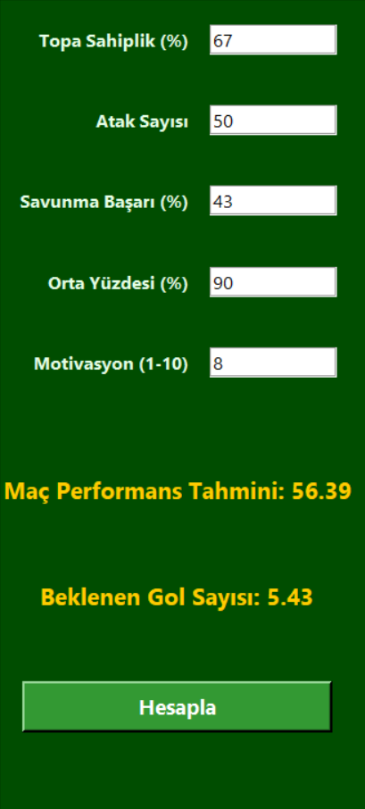
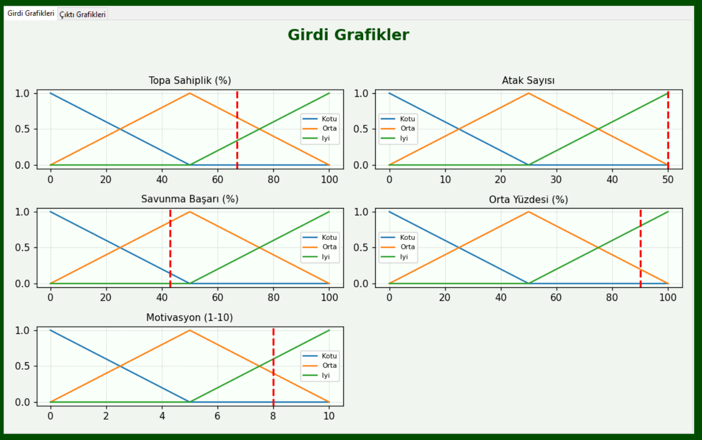
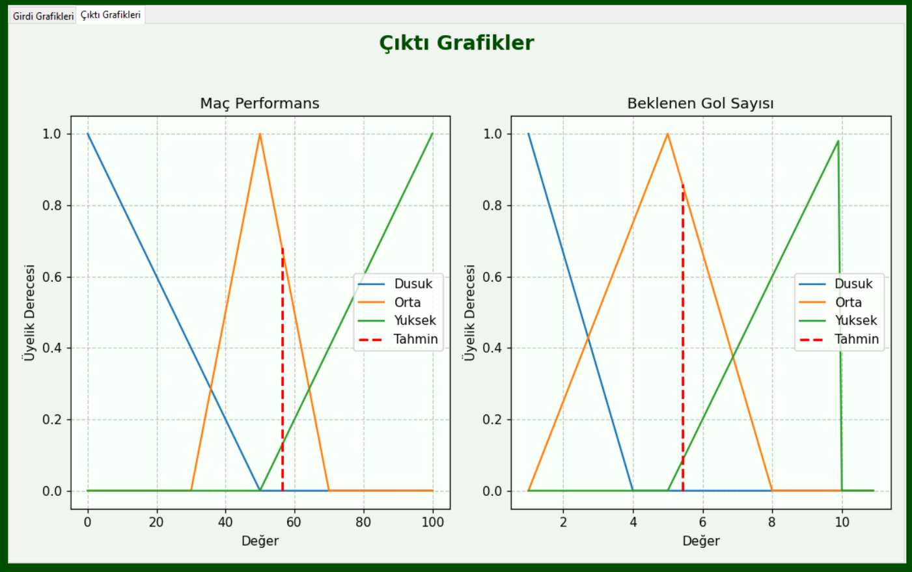

# ⚽ Futbolcu Maç Performansı ve Beklenen Gol Tahmini (Bulanık Mantık)

Bu proje, futbolcuların istatistiksel özelliklerine göre **maç performansı** ve **beklenen gol sayısını** tahmin eden bir **bulanık mantık (fuzzy logic)** uygulamasıdır. Python programlama dili ile geliştirilmiş olan bu proje, kullanıcıdan belirli futbol istatistikleri alarak, bu verilere göre çıktılar üretir.

## 🎯 Projenin Amacı

Futbolculardan ya da takımlardan elde edilen bazı temel performans verilerini kullanarak, maç sırasında nasıl bir performans sergileyebileceklerini ve ortalama kaç gol atmalarının beklendiğini tahmin eden bir sistem geliştirmektir. Bu sistem, özellikle antrenörler, analiz ekipleri ve futbol istatistikçileri için yol gösterici olabilir.

## 🔍 Kullanılan Giriş Verileri

Aşağıdaki 5 temel futbol istatistiği kullanıcıdan alınır:

| Özellik              | Açıklama |
|----------------------|----------|
| **Topa Sahiplik (%)**  | Oyunun yüzde kaçında top takımdaydı |
| **Atak Sayısı**        | Maç boyunca yapılan toplam atak sayısı |
| **Savunma Başarı (%)** | Rakibin ataklarına karşı yapılan başarılı savunma yüzdesi |
| **Orta Yüzdesi (%)**   | Yapılan ortaların isabet oranı |
| **Motivasyon (1-10)**  | Oyuncunun psikolojik ve fiziksel motivasyon derecesi |

Bu veriler, kullanıcı arayüzündeki form aracılığıyla girilmektedir.

## 🧠 Çıktılar

Sistem bu girişlere göre aşağıdaki iki çıktıyı üretir:

- **Maç Performansı (0-100)**: Futbolcunun maçtaki genel başarı seviyesi
- **Beklenen Gol Sayısı (0-10)**: Maçta gol atma ihtimaline dayalı ortalama gol sayısı

Bu çıktılar **bulanık mantık çıkarım sistemi (fuzzy inference system)** ile hesaplanır.

## 🖥️ Kullanıcı Arayüzü

Kullanıcı arayüzü `tkinter` ile oluşturulmuş olup aşağıdaki bileşenleri içerir:

### 📌 Giriş Paneli



### 📊 Girdi Üyelik Fonksiyonu Grafikler



### 📈 Çıktı Üyelik Fonksiyonu Grafikler



## ⚙️ Kullanılan Teknolojiler

- 🐍 **Python 3.x**
- 🔢 **scikit-fuzzy** – Bulanık mantık çıkarım sistemi için
- 🎨 **matplotlib** – Grafik çizimleri için
- 🧱 **tkinter** – GUI oluşturmak için

## 🧪 Örnek Kurallar

Sistemde tanımlı örnek bulanık kurallardan bazıları şunlardır:

- Eğer **Topa Sahiplik** iyiyse VE **Atak Sayısı** iyiyse, o zaman **Beklenen Gol** yüksektir.
- Eğer **Savunma Başarısı** kötüyse VE **Motivasyon** düşükse, o zaman **Maç Performansı** düşüktür.
- Eğer **Orta Yüzdesi** ortaysa VE **Atak Sayısı** yüksekse, o zaman **Beklenen Gol** ortadır.

## 📁 Dosya Yapısı

```
futbol-performans-tahmin/
│
├── main.py                  # Ana uygulama dosyası (GUI ve tahmin motoru)
├── grafikler.py             # Grafik çizim fonksiyonları
├── fuzzy_sistem.py          # Bulanık mantık kuralları ve üyelik fonksiyonları
├── Değerler.PNG             # Giriş panel ekran görüntüsü
├── GirdiGrafikler.PNG       # Girdi grafik ekran görüntüsü
├── ÇıktıGrafikler.PNG       # Çıktı grafik ekran görüntüsü
└── README.md                # Proje açıklama dosyası
```

## 👨‍💻 Geliştirici

- **Metin Kepenek**

## 🚀 Kurulum ve Çalıştırma

Aşağıdaki adımları takip ederek projeyi kendi bilgisayarınızda çalıştırabilirsiniz:

### 1. 📥 Projeyi Klonlayın

```bash
git clone https://github.com/kullanici-adi/futbol-performans-tahmin.git
cd futbol-performans-tahmin
```

### 2. 🧪 Sanal Ortam Oluşturun (Opsiyonel)

```bash
python -m venv venv
venv\Scripts\activate        # Windows için
source venv/bin/activate    # Linux/macOS için
```

### 3. 📦 Gereken Kütüphaneleri Kurun

```bash
pip install -r requirements.txt
```

Eğer `requirements.txt` dosyanız yoksa aşağıdaki komutu kullanabilirsiniz:

```bash
pip install scikit-fuzzy matplotlib
```

### 4. ▶️ Uygulamayı Başlatın

```bash
python main.py
```
