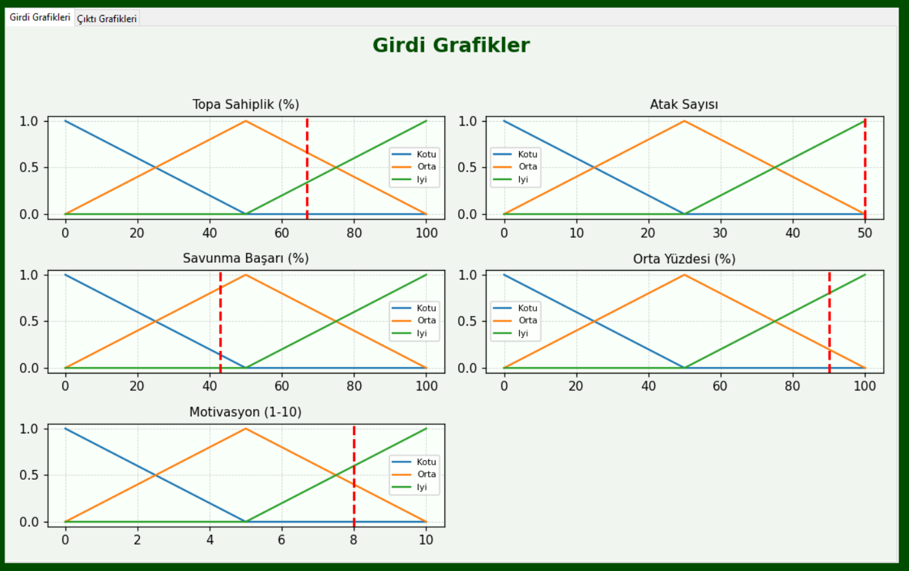
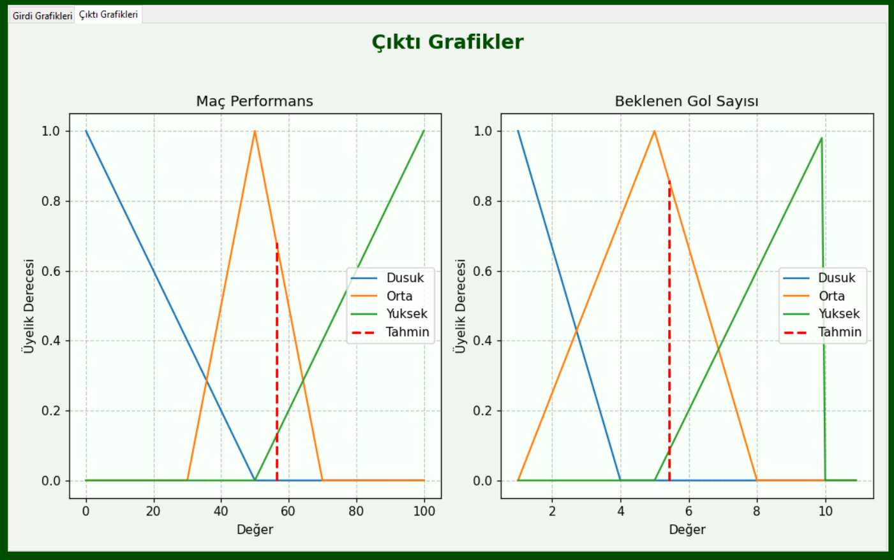

# ⚽ Futbolcu Maç Performansı ve Beklenen Gol Tahmini (Bulanık Mantık)

Bu proje, futbolcuların istatistiksel özelliklerine göre **maç performansı** ve **beklenen gol sayısını** tahmin eden bir **bulanık mantık (fuzzy logic)** uygulamasıdır. Python programlama dili ile geliştirilen bu sistem, kullanıcıdan alınan futbol istatistikleriyle çıktılar üretir.

---

## 🎯 Projenin Amacı

Futbolculardan ya da takımlardan elde edilen temel performans verilerini kullanarak:

* Maçta beklenen **performans düzeyini**,
* **Gol atma ihtimaline** dayalı ortalama gol sayısını,

tahmin eden bir sistem geliştirilmesi hedeflenmiştir. Sistem, antrenörler, analiz ekipleri ve futbol istatistikçileri için öngörüler sağlamak amacıyla tasarlanmıştır.

---

## 🔍 Kullanılan Giriş Verileri

Kullanıcıdan aşağıdaki 5 temel futbol istatistiği alınır:

| Özellik                | Açıklama                                     |
| ---------------------- | -------------------------------------------- |
| **Topa Sahiplik (%)**  | Takımın topa sahip olma oranı                |
| **Atak Sayısı**        | Maç boyunca yapılan toplam atak sayısı       |
| **Savunma Başarı (%)** | Yapılan savunmaların başarı oranı            |
| **Orta Yüzdesi (%)**   | Yapılan ortaların isabet oranı               |
| **Motivasyon (1-10)**  | Oyuncunun psikolojik ve fiziksel motivasyonu |

Bu veriler girildiği anda **anlık olarak girdi grafiğine yansır.**

---

## 🧐 Çıktılar

Giriş verileriyle hesaplanan iki ana çıktı vardır:

* **Maç Performansı (0-100)**
* **Beklenen Gol Sayısı (0-10)**

Bu değerler, **bulanık mantık çıkarım sistemi** kullanılarak elde edilir.

---

## 💻 Kullanıcı Arayüzü

Arayüz `tkinter` kullanılarak geliştirilmiştir ve şu bölümleri içerir:

### 📌 Giriş Paneli

* Kullanıcıdan 5 temel istatistiğin alındığı form.
* Veriler girildiği anda **anlık olarak girdi grafiklerine yansır.**


### 📊 Girdi Üye Fonksiyonu Grafikler

* Her girdi için tanımlanan üye fonksiyonları.
* **Hesapla butonuna basıldığında bu grafikler kapanır.**



### 📈 Çıktı Grafikler

* Çıktıya yönelik üye fonksiyonları.
* **Hesapla butonuna basıldığında otomatik olarak görülür.**



### 📸 Genel Arayüz

Tüm arayüz bileşenlerinin birlikte görüldüğü bir ekran görüntüsü:


---

## ⚙️ Kullanılan Teknolojiler

* Python 3.x
* scikit-fuzzy
* matplotlib
* tkinter

---

## 🤮 Örnek Kurallar

Sistemde yer alan bazı bulanık kurallar:

* ✅ Topa Sahiplik *iyi* VE Atak Sayısı *fazla* ise → Beklenen Gol *yüksek*
* ❌ Savunma Başarısı *kötü* VE Motivasyon *düşük* ise → Maç Performansı *zayıf*
* ➕ Orta Yüzdesi *orta* VE Atak Sayısı *fazla* ise → Beklenen Gol *orta*

---

## 📁 Dosya Yapısı

```
futbol-performans-tahmin/
|
├── fuzzy.py                  # Ana uygulama (GUI + hesaplama)
├── Değerler.PNG             # Giriş paneli ekran gör.
├── GirdiGrafikler.PNG       # Girdi grafik ekran gör.
├── ÇıktıGrafikler.PNG       # Çıktı grafik ekran gör.
├── AnaSayfa.PNG            # Tüm sistem ekran gör.
└── README.md                # Proje dokümantasyonu
```

---

## 👨‍💼 Geliştirici

* ✨ **Metin Kepenek**
  Mersin Üniversitesi - Bilgi Sistemleri ve Teknolojileri Öğrencisi

GitHub: [github.com/metinkepenek](https://github.com/metinkepenek)

---

## 🚀 Kurulum ve Çalıştırma

### 1. Projeyi Klonlayın

```bash
git clone https://github.com/metinkpnk/FuzzyFootballPerformance.git
cd futbol-performans-tahmin
```

### 2. Sanal Ortam Oluşturun (Opsiyonel)

```bash
python -m venv venv
venv\Scripts\activate        # Windows
source venv/bin/activate    # macOS/Linux
```

### 3. Gerekli Kütüphaneleri Kurun

```bash
pip install -r requirements.txt
```

Eğer yoksa:

```bash
pip install scikit-fuzzy matplotlib
```

### 4. Uygulamayı Başlatın

```bash
python fuzzy.py
```

---

## 💡 Gelecek Geliştirmeler

* Takım bazlı analiz modülü
* Gerçek zamanlı veri ile eş zamanlı tahmin
* Mobil uyumluluk (Kivy, Flutter)
* ML destekli karar sistemleri

---

Her türlü geri bildirim için bizimle iletişime geçebilirsiniz. Projeyi faydalı bulduysanız ⭐ bırakmayı unutmayın! ⚽
